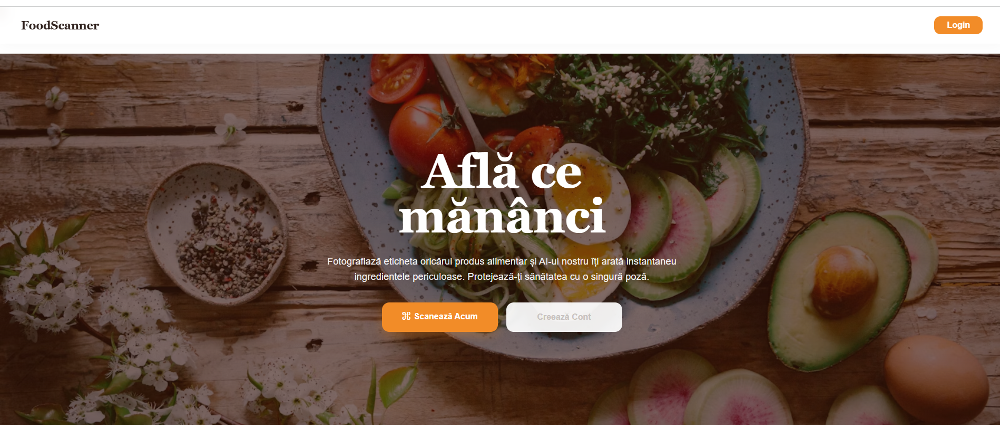
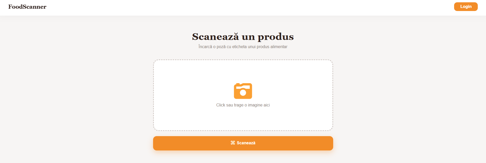
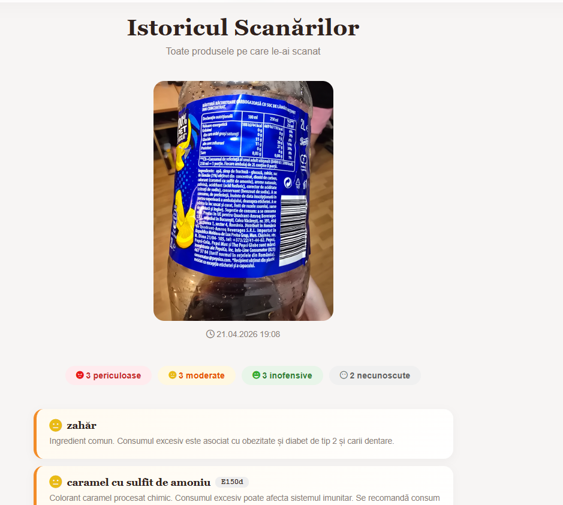

# FoodScanner

FoodScanner is a web application for scanning Romanian food labels, extracting ingredient lists with OCR, and highlighting ingredients that may require attention based on a simple risk classification system.

The project combines a custom OCR pipeline with a FastAPI backend and a lightweight server-rendered frontend. It was developed around Romanian food label data, using a fine-tuned TrOCR model for printed ingredient recognition.

## Features

- Upload food label images through a web interface
- Detect and extract text from ingredient labels
- Recognize Romanian printed text using a fine-tuned TrOCR model
- Classify detected ingredients as `safe`, `moderate`, `dangerous`, or `unknown`
- Store scan results using SQLite
- Support user authentication with JWT
- Display previous scans and ingredient-level risk explanations

## Screenshots

### Landing page



### Product scan page



### Scan history and ingredient results



## OCR Results

Fine-tuning significantly improved text recognition performance on Romanian food label crops.

| Model | Character Error Rate |
| --- | ---: |
| TrOCR base printed | 38.1% |
| Fine-tuned TrOCR | 5.4% |

## Tech Stack

- **Backend:** FastAPI, SQLite, JWT authentication
- **Frontend:** Jinja2 templates, vanilla JavaScript, HTML, CSS
- **OCR detection:** PaddleOCR
- **OCR recognition:** Fine-tuned `microsoft/trocr-base-printed`
- **Model training data:** 890 Romanian food label crops

## Project Structure

```text
FoodScanner/
+-- App/
|   +-- src/
|       +-- main.py          # FastAPI application entry point
|       +-- router.py        # Scan and application routes
|       +-- auth/            # Authentication and JWT logic
|       +-- ocr/             # OCR detection and recognition pipeline
|       +-- templates/       # Jinja2 templates
|       +-- static/          # CSS and JavaScript assets
+-- experiments/             # OCR experiments and thesis-related work
+-- README.md
```

## Setup

### 1. Clone the repository

```bash
git clone https://github.com/YOUR_USERNAME/FoodScanner.git
cd FoodScanner
```

### 2. Install dependencies

```bash
pip install -r requirements.txt
```

### 3. Download the fine-tuned OCR model

The fine-tuned TrOCR model is not included in the repository because of its size.

Download the model from the provided external link and place it in:

```text
trocr-model-romanian-final/
```

Expected structure:

```text
FoodScanner/
+-- trocr-model-romanian-final/
    +-- config.json
    +-- generation_config.json
    +-- model.safetensors
    +-- preprocessor_config.json
    +-- tokenizer files
```
